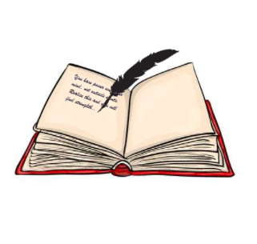

# NEB Simplified English-XII

This is my first flutter-based mobile application which is a complete package which covers almost all the areas of NEB- grade 12 English including-
Summaries and Solutions - Heritage of Words,
Solutions- Meaning into Words (Student's Book),
Past Question Papers and Model Set Questions,
Samples of Free-Writing (includes: job application, movie/book review, editorial, etc.)
Examples, meanings and use of Idioms, Proverbs, Metaphors, Similes, Paradox(25 each)

Features-
Aesthetic UI
Dark Mode available

Note: The notes used in this app cannot be used for the benefit of similar such applications or platforms.
